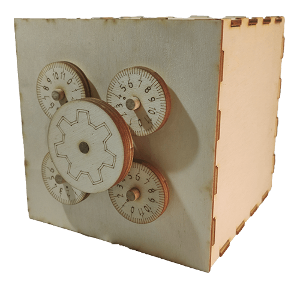

# O co jde?  

BlackBox M3 je mechanická stavebnice a představuje jednoduchý trezor. Skládá se z řady Potřebný materiál: překližkových dílů, vypálených na laseru, a několika dřevěných kolíků. 

Na ovládacích kolečkách jsou vygravírované číselníky, na kterých se dá při výrobě nastavit požadovaný kód. Celý výrobek pak má tvar krychle o straně 128 mm, což je násobek 16, a tak se dá BlackBox jednoduše zkombinovat s dřívky.

