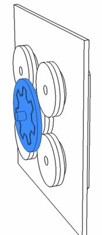

# Manuál

 
1. Připravíme si díly začínající písmenem B, které můžete vidět na obrázku

 
2. Slepíme díly B0, B1 a B5 dle obrázku. Slepíme všechny současně, aby byla zachována kolmost

 
3. Přilepíme díl B4

 
4. Přilepíme díl B3

 
5. Přilepíme díl B5 a máme hotové tělo trezoru

 
6. Nachystáme si díly D0 a D1 a jako pomůcku si připravíme kousek dvou kolíků o průměru 10 mm a 7 mm. Následně slepíme díly D0 a D1 a **aby nám na sebe díly seděly, vložíme do středního otvoru 10 mm kolík a do jednoho z krajních 7 mm kolík.** Tím máme zajištěno, že se nám díly nepohnou a již je jen sevřeme svorkou.

 
7. Nachystáme si dlouhý kolík (D6x33) a díly K0, K1, dva díly K2, čtyři díly K3 a tři díly K4.

 
8. Nalepíme díly K0 a K1 na dlouhý kolík na sebe tak, aby konec kolíku byl zarovnaný s plochou dílu D0. Po slepení důkladně otřeme všechna místa, kde vyteklo lepidlo, především ve vnitřních rozích.

 
9. Nalepíme díl D2 dle obrázku a opět důkladně otřeme přebytky lepidla

 
10. Výsledný slepenec B z předchozího kroku nasuneme do slepence A (díly D0,D1). Zkontrolujeme, že se mohou vůči sobě otáčet, a pokud ne, lehce obrousíme kroužky K2 na slepenci B a střední otvor na slepenci A. **Nic nelepíme!**

 
11. Nachystáme si jeden krátký kolík a díly S0, S1 a dva díly S1.

 
12. Nalepíme díl S0 na kolík tak, aby byl konec kolíku zarovnaný s dílem S0.

 
13.  Nalepíme díl S1 a jakékoli přebytky lepidla důkladně otřeme

 
14.  Nalepíme druhý díl S1. Kroky 12 až 15 ještě 3x zopakujeme, abychom měli
tento díl **4x**

 
15. Postupně vložíme všechny čtyři slepence C do slepence A, a vyzkoušíme, jestli se může volně točit. Pokud ne, zkontrolujeme, jestli někde nezůstalo nadbytečné lepidlo, případně můžeme styčné plochy lehce obrousit.
**Nic nelepíme!**

 
16. Připravíme si slepence A a B dle obrázku. **Nic nelepíme!**

 
17. Nasuneme jeden díl K3 na kolík dle obrázku. **Nic nelepíme!**

 
18. Postupně nalepíme všechny díly K3 na kolík i na předchozí díl K3

 
19. Postupně nalepíme všechny díly K3 na kolík i na předchozí díl K3

 
20. Postupně nalepíme všechny díly K3 na kolík i na předchozí díl K3

 
21. Natočíme si západku dle obrázku. **Nic nelepíme!**

 
22. Do jednoho z otvorů vložíme jeden ze čtyř slepenců C. **Nic nelepíme!**

 
23. Otočíme západku zpět, aby nám držela slepenec C na místě. Slepenec C je třeba natočit tak aby se dalo otočit západkou. **Nic nelepíme!**

 
24. Nasuneme kroužek S2 na kolík slepence C dle obrázku. **Nic nelepíme!**

 
25. Nalepíme kroužek S3 na kolík i na předchozí kroužek S2

 
26. Zopakujeme kroky 20 až 24 i pro ostatní slepence C

 
27. Zopakujeme kroky 20 až 24 i pro ostatní slepence C

 
28. Zopakujeme kroky 20 až 24 i pro ostatní slepence C

 
29. Abychom mohli trezor otevřít, musíme na něm zadat správné heslo. Toto heslo si proto teď zvolíme pomocí čtyř číselníkových koleček S4. Abychom věděli, v jakém pořadí jsou číselníky za sebou, má každý z nich tečku, která pořadí prozrazuje. Zkontrolujeme si, že nemáme víc stejných číselníku a že je máme všechny. Pokud máme vše a máme zvolené heslo, můžeme přistoupit k nalepení číselníku.

 
30. Postupně nalepíme všechny tři díly K4 dle obrázků

 
31. Postupně nalepíme všechny tři díly K4 dle obrázků

 
32. Necháme vše zaschnout a máme hotovo

