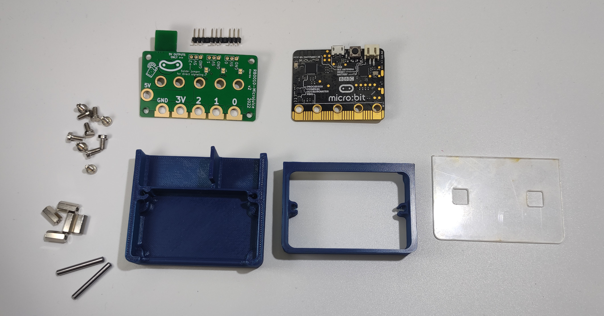
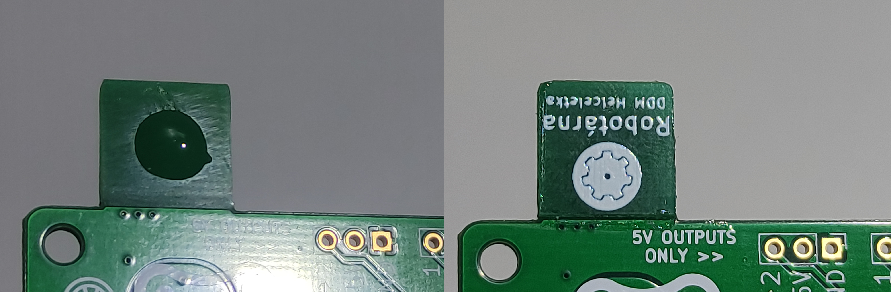
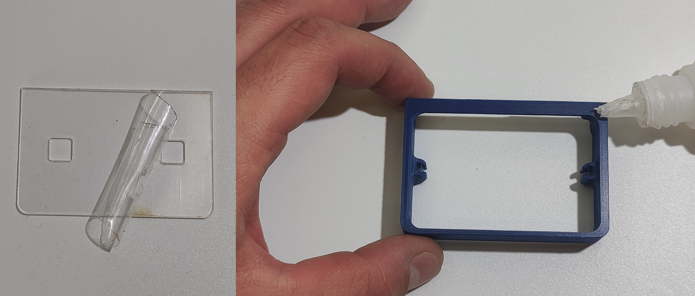
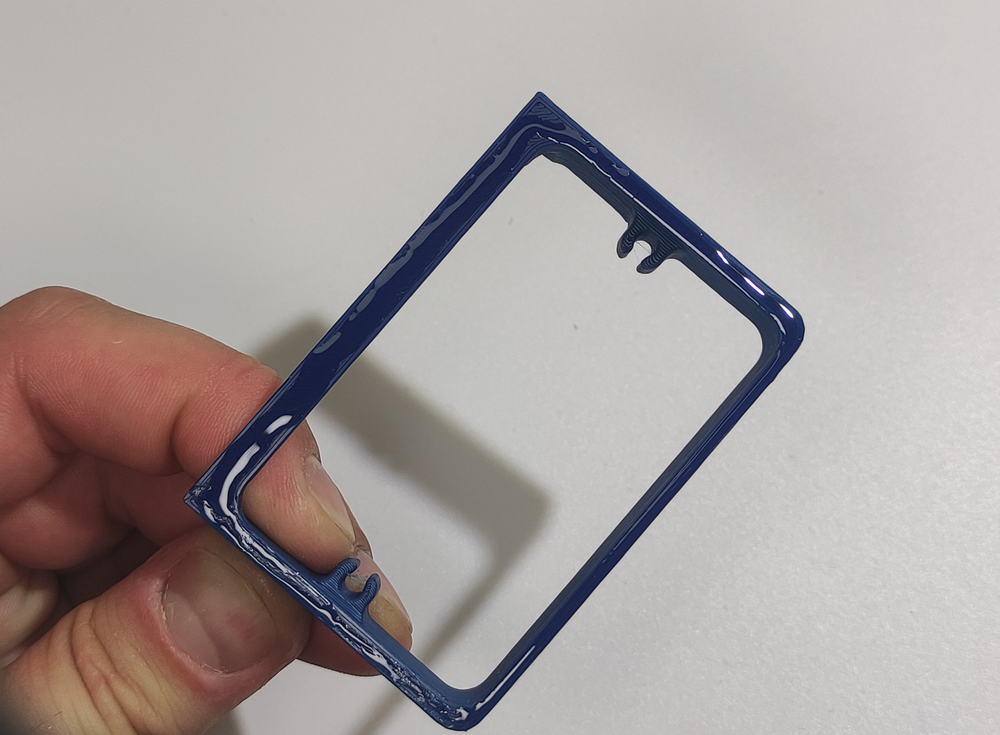
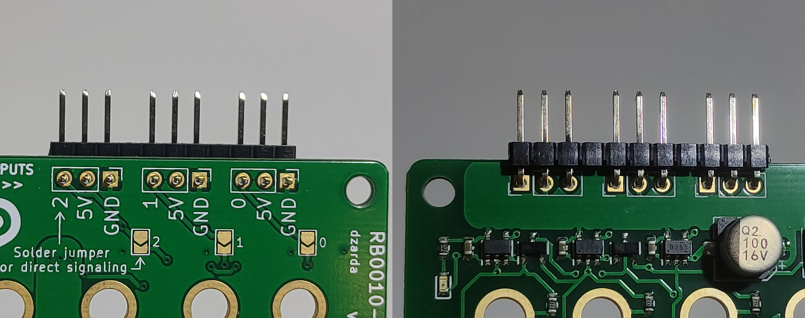
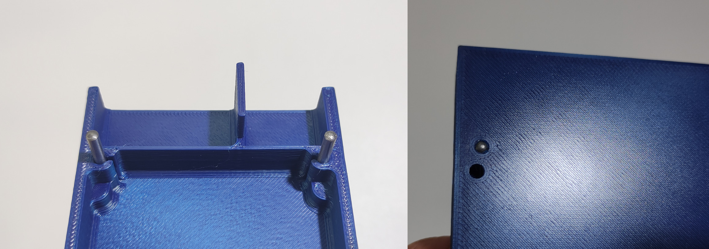
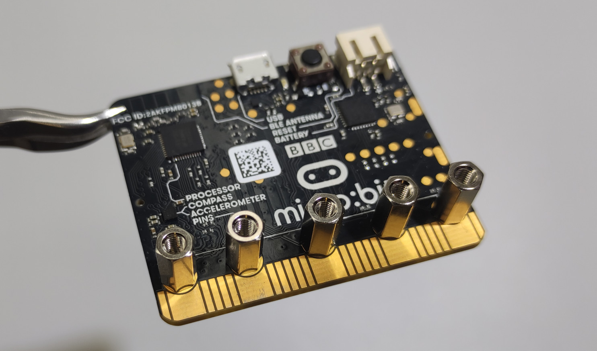
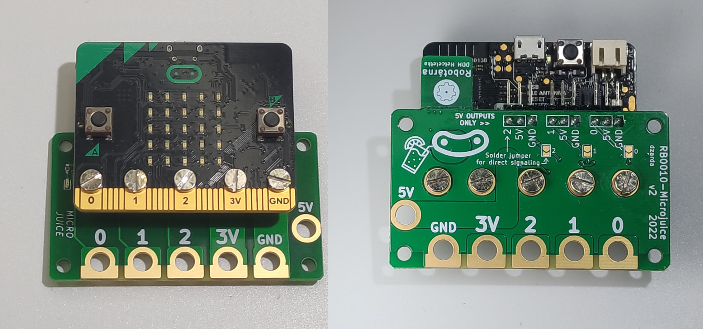
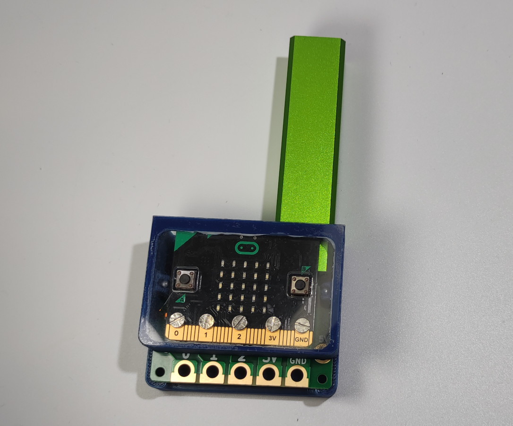

# Manuál

## Potřebný materiál

- Deska MicroBit
- Deska MicroJuice *(olámeme okraje, např. kleštěmi)*
- Destička pro podlepení USB *(k dostání u lepení)*
- Pinová lišta (pinhead) zahnutá délky 11
- 5 distančních sloupků 10mm
- 10 šroubů M3
- 2 ocelové kolíky 3x24mm
- Plastové díly krabičky (2)
- Plexi kryt krabičky

 

## Návod na složení

 
1. Podlepíme USB konektor podložkou. Použijeme vhodné množství vteřinového lepidla - kapka maximálně tak velká, jako je na obrázku. Dbáme na přesné osazení.

 
 
2. Odlepíme ochrannou folii <b>z jedné strany</b> plexi. Na vrchní obvod horní poloviny krabičky naneseme souvislou tenkou vrstvu lepidla. Správnou stranou přilepíme.

!!! tip "Důležité je přesné osazení. Netlačit příliš na plexi, je křehké."

 
3. Připájíme pinovou lištu. Z kousku pinheadu délky 11 opatrně vytáhneme dva piny (pinzetou, kleštěmi) tak, aby vznikly tři trojice. Vložíme ze strany součástek, připájíme. Můžeme zajistit očištění tavidla.

 
4. Vtlačíme ocelové kolíky do spodní poloviny krabičky, aby byly na spodní straně zarovnané. S citem můžeme použít kladivo. Pokud sloupky málo drží, lze zakápnout lepidlem.

 
5. Přišroubujeme distanční sloupky do děr v MicroBitu, aby byly hlavy šroubů středově sladěné s dírami. Utahujeme dostatečně.

!!! tip "Zvažte použití kleští pro přidržení sloupků. Pozor na součástky!"

 
6. Přišroubujeme MicroJuice k distančním sloupkům. Utahujeme dostatečně.

 
7. Voilá

