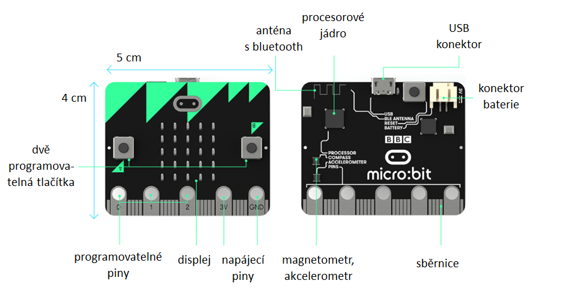

# O co jde?

Micro:bit je kapesní počítač velmi vhodný do výuky na základní i střední škole.
Umožňuje učit základy programování atraktivně a hmatatelně v různých jazycích:

- [x] blokové programování
- [x] JavaScript
- [x] Python

[Programování MicroBitu](https://makecode.microbit.org/){ .md-button .md-button--primary target='_blank' }

Micro:bit `v1` má přímo vestavěno několik chytrých periferií:

- [x] programovatelná tlačítka
- [x] displej (5×5 bodů)
- [x] vstupně-výstupní porty
- [x] akcelerometr – zrychlení, třesení, náklon
- [x] magnetometr – orientace vůči magnetickému poli Země
- [x] senzor teploty (jádra procesoru)
- [x] měřič intenzity světla
- [x] bluetooth
- [x] rádio

[Zdroj textu](https://www.microbiti.cz/2019/03/co-je-bbc-microbit.html){ target='_blank' }