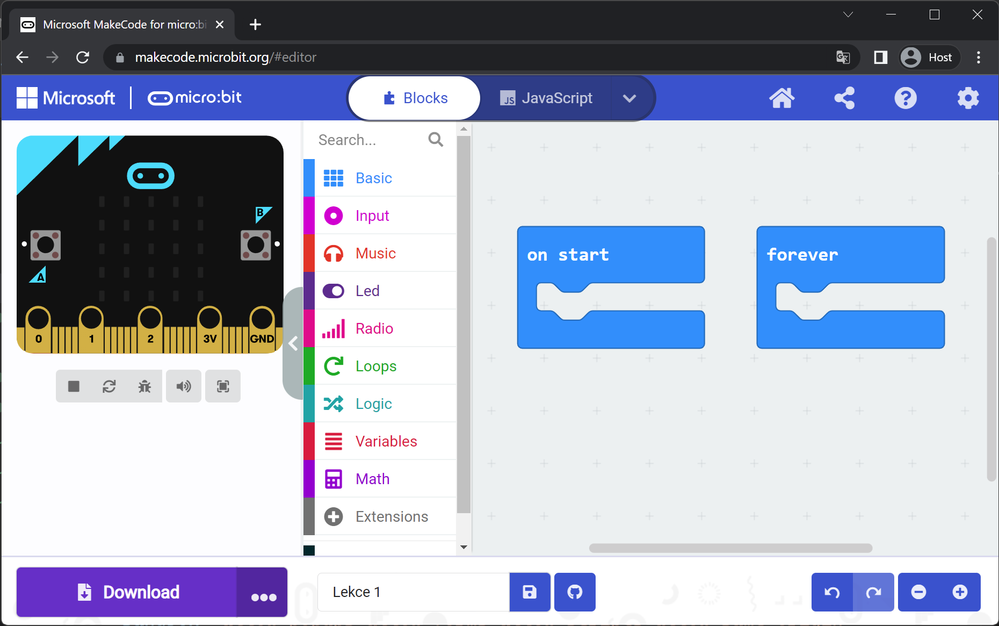

# Lekce 1

Otevřeme si programovací prostředí <a target="_blank" href="{{ microbit_url }}">Makecode</a>, které si krátce představíme.

Ke kontrole běhu programu slouží bloky `on start` (`při startu`) a `forever` (`opakuj stále`). Bločky umístě v bloku `on start` se vykonají pouze jednou při spuštění a bločky v bloku `forever` se opakují do nekonečna.

## Zadání A

Zobrazíme něco na displeji.

### Ukázka

{{ microbit_simulator("project_1A") }}

??? Řešení
	{{ microbit_code("project_1A") }}

## Připojení MicroBitu
Budeme postupovat podle <a target="_blank" href="https://makecode.microbit.org/device/usb">návodu</a>.

## Zadání B
Vypíšeme si svoje jméno na displej (nepoužívejte diakritiku).

### Ukázka

{{ microbit_simulator("project_1B") }}

??? Řešení
	{{ microbit_code("project_1B") }}

## Zadání C
Budeme blikat LEDkou na displeji.

### Ukázka

{{ microbit_simulator("project_1C") }}

??? Řešení
	{{ microbit_code("project_1C") }}

## Zadání výstupního úkolu
Vytvořte animaci zvětšujícího a zmenšujícího se čtverečku.
