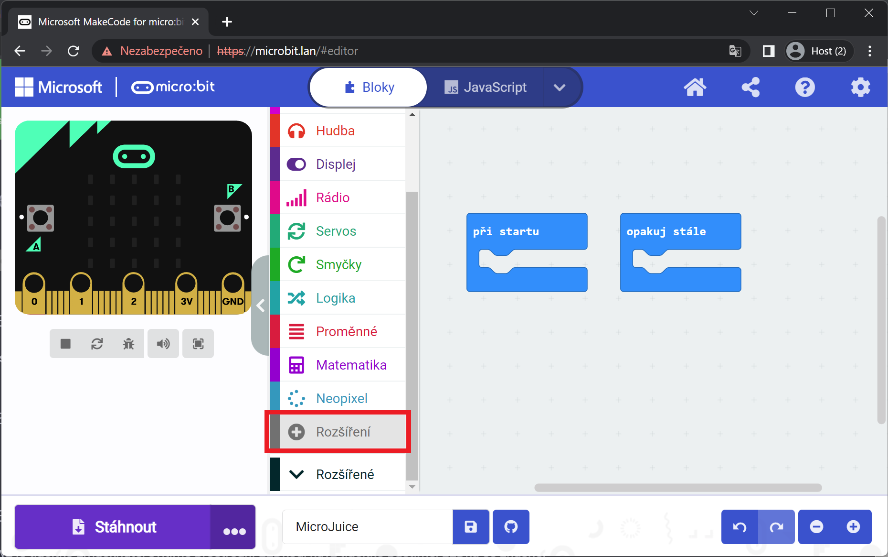
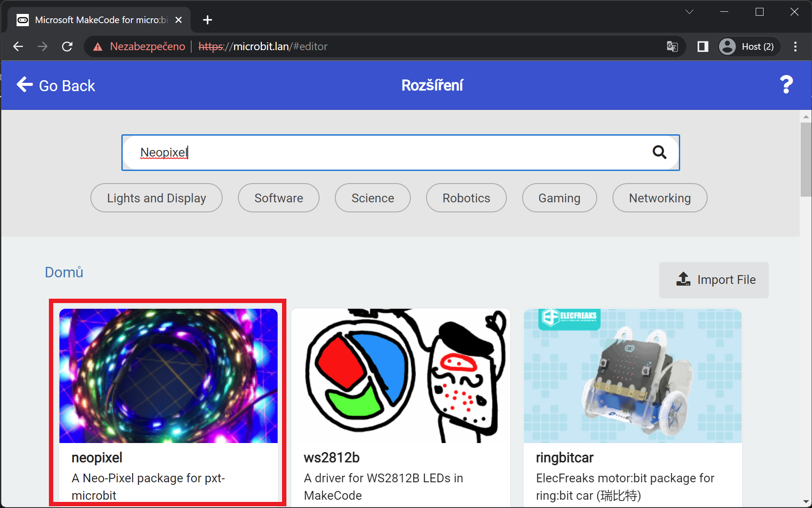
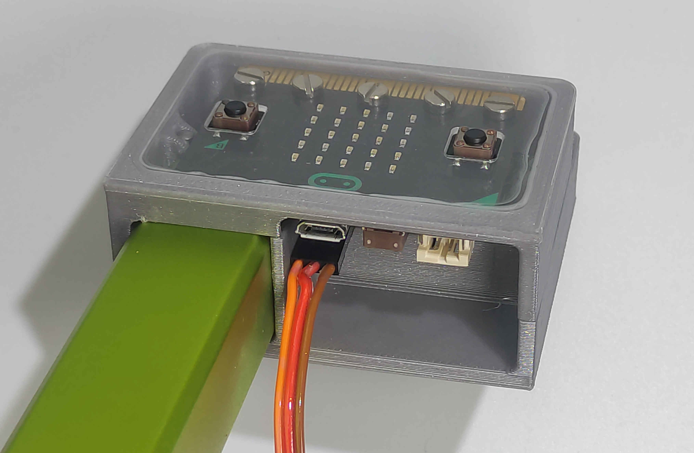

# Lekce 4

V této lekci si představíme MicroJuice a připojíme si RGB LED pásek

Pomocí rozšiřujícího modulu lze k MicroBitu připojit Hradla/Elektron, Servo a inteligentní LEDky (Neopixel).

## Instalace knihoven

Otevřeme seznam rozšíření k instalaci.

Vyhledáme potřebnou knihovnu (Neopixel, Servo) a kliknutím na ni ji nainstalujeme. Ty se poté objeví v seznamu bloků.

!!! Upozornění warning
    Pro každý projekt je potřeba knihovny instalovat zvlášť.

## Připojení součástek

!!! Upozornění danger
    Při připojování součástek si pečlivě zkontrolujte, že je kabel správně otočený.

## Zadání A1
Budeme otáčet servo podle azimutu z kompasu.

## Zadání A2
Budeme nastavovat rychlost serva podle okolního osvětlení.

## Zadání B
Zobrazíme duhu a budeme jí posouvat po displeji.

## Zadání výstupního úkolu
Vytvořte animaci jedné svítící LEDky, která běhá po LED pásku tam a zpět (Knight Rider).
