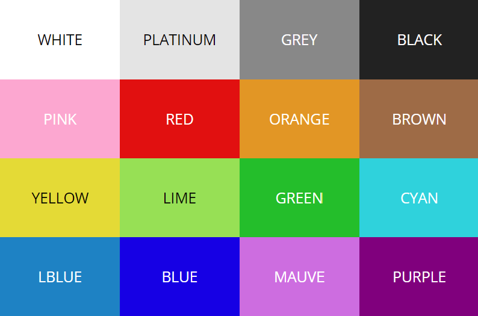

# Lekce 6 - radio

V této lekci se seznámíme s bezdrátovou komunikací mezi MicroBity.

## Zadání A

Posílejte pomocí rádia příkazy, které půjčený MicroBit poslouchá a posouvá podle toho rozsvícenou LED na displeji.

Na posílání souřadnic použijte `radio send value` funkci, se jmény hodnot `"x"` a `"y"`, každá v rozmezí od 0 do 4 včetně.

### Ukázka

{{ microbit_snippet("project_6A") }}

## Zadání B

Poslouchejte příkazy na rádiu, které posílá půjčený MicroBit a posouvejte podle toho rozsvícenou LED na displeji.

Na přijetí hodnot použijte blok `on radio received (name) (value)`, budou vám přicházet číselné hodnoty s názvy `"x"` a `"y"`, každá v rozmezí od 0 do 4 včetně.

### Ukázka

{{ microbit_snippet("project_6B") }}

## Zadání C

Ve dvojicích si vyzkoušejte jeden do MicroBitu nahrát Úkol A a druhý Úkol B a ovládejte si MicroBity mezi sebou.

## Zadání výstupního úkolu V1

Posílejte pomocí rádia načtená data ze senzoru a na druhém MicroBitu je nějak zobrazte na displeji (můžete vzít úkol z lekce 3 a data ze senzoru dodávat z druhého MicroBitu).

## Zadání výstupního úkolu V2

Někde běží MicroBit připojený k projektoru a zobrazuje obrázek, který můžete pomocí příkazů z rádia po jednotlivých pixelech překreslovat.
Posílejte zprávy pomocí bloku `radio send string` v následujícím formátu:

`<secret-id> <x> <y> <color>`

`<secret-id>` dostanete přiřazené na začátku lekce a s nikým ho nesdílejte. Po poslání příkazu se pixel na obrázku změní a dostanete zpátky textovou zprávu `OK`, když příkaz není v pořádku, přijde vám textová zpráva `ERROR`. Pixely můžete měnit jednou za časový interval. Pokud chcete měnit pixely moc rychle, dostanete odpověď `TIMEOUT`.

Barvy vybírejte z následující tabulky a označujte je napsaným názvem:


### Příklad komunikace

```
ferda 0 3 RED
OK
ferda 1 2 GREEN
OK

spatneNapsanyPrikaz
ERROR
```
