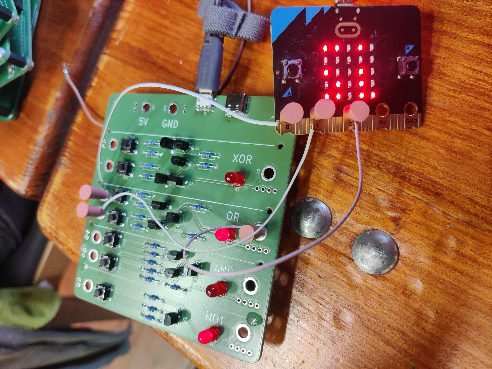

# Lekce 8 - scanner hradel

V této lekci se pokusíme pomocí micro:bitu automaticky vytvořit pravdivostní tabulku pro Hradla, která k němu připojíme.

Potřebujeme:

* micro:bit
* Hradla
* USB kabel pro napájení hradel
* Drátky a špuntíky na propojení

Propojení micro:bitu a Hradle může vypadat třeba takto (zatím nemusíte zapojovat).
Piny P0 a P1 jsou připojené dráty a špuntíky na vstupní díry nalevo, a P2 je zapojený na výstup napravo.



### Vykreslená pravdivostní tabulka
Pokusíme se replikovat pravdivostní tabulky z návodu v sekci hradla. První 4 řádky udávají stav jednotlivých pinů. První dva sloupečky jsou vstupy, 4. sloupeček je pak výstup.


**Pokuste se kód vymyslet sami**, v případě nesnází koukněte na popis řešení níže.

## Řešení

### Datové struktury
K vykreslování budeme používat opět herní engine - je to jednodušší, protože se kreslí sám, a ve spritech  jsou pěkně zapouzdřené vlastnosti, které bychom jinak museli udržovat zvlášť.

Nejprve si vytvoříme datové struktury:

* pro stav pinů (seznam čísel)
* renderované piny (pole spritů)

```js
let pinStates: number[] = []
let pinSprites: game.LedSprite[] = []
pinSprites = []
```

### Testování hradel
Dále musíme na micro:bitu nastavit výstupní piny, a zaznamenat jejich pozici.
Protože toto budeme opakovat celkem 4x (tolik je možností různých nastavení dvou pinů),
vytvoříme si na to funkci, kterou budeme později volat několikrát za sebou.

Aby funkce poznala, který řádek má testovat, dostane parametr `index`, který nabude hodnoty mezi 0 a 3 včetně.
Díky této skutečnosti mužeme vydedukovat stavy pinů z této `index proměnné` pomocí operací "zbytek po dělení" `%` a "celočíselné dělení" `Math.idiv`.

Díky tomu nemusíme mít několik ifů, ale stačí použít tyto matematické operace.

_Šlo by také použít bitové AND, `index & 0b01` a `index & 0b10`, ale MakeCode ho neumí._

| index | P0 `index % 2` | P1 `Math.idiv(index, 2)` |
| ----- | -------------- | ------------------------ |
| 0     | 0              | 0                        |
| 1     | 1              | 0                        |
| 2     | 0              | 1                        |
| 3     | 1              | 1                        |


```js
let pinStates: number[] = null

function otestujHradloKombinaci (index: number) {
    pins.digitalWritePin(DigitalPin.P0, index % 2)
    pinStates.push(index % 2)
    basic.pause(500)

    pins.digitalWritePin(DigitalPin.P1, Math.idiv(index, 2))
    pinStates.push(Math.idiv(index, 2))
    basic.pause(500)
}
```

Můžeme spatřit, že děláme 2x téměř stejné věci i v této funkci. Zkusme je tedy vytknout do samostatné funkce.
V MakeCode bohužel nejde předávat číslo pinu jako parametr, takže duplikaci se úplně nevyhneme.

```js
let pinStates: number[] = null

function vykresliPin(value: number) {
    pinStates.push(value)
    basic.pause(500)
}
function otestujHradloKombinaci(index: number) {
    pins.digitalWritePin(DigitalPin.P0, index % 2)
    vykresliPin(index % 2)
    pins.digitalWritePin(DigitalPin.P1, Math.idiv(index, 2))
    vykresliPin(Math.idiv(index, 2))
}
```

Dále musíme vyčíst výsledkovou hodnotu z pinu `P2`. Hradla mají na výstupu poměrně nízké napětí, ktere nepřepne pin na hodnotu 1 při `digitalRead`, musíme proto použít `analogRead`, který změří napětí na pinu a přemění ho na hodnotu od 0 do 1023 včetně.

```js
let pinStates: number[] = null

function vykresliPin(value: number) {
    pinStates.push(value)
    basic.pause(500)
}
function otestujHradloKombinaci(index: number) {
    pins.digitalWritePin(DigitalPin.P0, index % 2)
    vykresliPin(index % 2)
    pins.digitalWritePin(DigitalPin.P1, Math.idiv(index, 2))
    vykresliPin(Math.idiv(index, 2))
    if (pins.analogReadPin(AnalogPin.P2) > 256) {
        vykresliPin(1)
    } else {
        vykresliPin(0)
    }
}
```

### Vykreslování výsledků
Nejjednodušší způsob, jak docílit vykreslování, je při každé změně odstranit existující sprite a vytvořit nové podle obsahu seznamu `pinStates`.

Aktivní sprites si udržujeme v seznamu `pinSprites`, stačí z něj tedy postupně odstraňovat prvky, dokud není prázdné. Pin v nulovém stavu se označí sice spritem, ale s jasem nastaveným pouze na `7`.

Všimněte si použití `% 3` (zbytek po dělení 3) na vypočítání X pozice spritu, a `/ 3` na vypočítání Y pozice.

Volání `renderPinStates` je také třeba přidat do `vykresliPin`, kde měníme `pinStates`

```js
let x = 0
let pinSprites: game.LedSprite[] = null
let pinStates: number[] = null
function renderPinStates() {
    while (pinSprites.length > 0) {
        pinSprites.pop().delete()
    }
    for (let index2 = 0; index2 <= pinStates.length - 1; index2++) {
        x = index2 % 3
        if (x == 2) {
            x = 3
        }
        let sprite: game.LedSprite = game.createSprite(x, index2 / 3)
        if (pinStates[index2] == 0) {
            sprite.set(LedSpriteProperty.Brightness, 7)
        }
        pinSprites.push(sprite)
    }
}

function vykresliPin(value: number) {
    pinStates.push(value)
    renderPinStates()
    basic.pause(500)
}
```

### Reakce na tlačítko
Zbývá nám poslední část, a to samotné volání funkce `otestujHradloKombinaci`. Budeme ji volat po stistku tlačtíka A, před začátkem vymažeme aktuální `pinStates` a na konci vrátíme výstupní piny na 0.

```js
function otestujHradloKombinaci (index: number) {
}

input.onButtonPressed(Button.A, function () {
    pinStates = []
    for (let index = 0; index <= 3; index++) {
        otestujHradloKombinaci(index)
    }
    pins.digitalWritePin(DigitalPin.P0, 0)
    pins.digitalWritePin(DigitalPin.P1, 0)
})
```

V tomto bodě by scanner měl fungovat - **zkuste ho připojit na Hradla a otestovat jednotlivé logické funkce!**

#### Celý kód

{{ microbit_snippet("project_8A") }}


## Bonus - historie
Je příhodné přidat do kódu ukládání naměřených pravdivostních tabulek, abyste je mohli porovnat.

Ukládání lze provést pomocí "seznamu seznamů" - celé `pinStates` uložíme jako prvek do seznamu `history`.
Toto lze provést v rámcí handleru eventu stihnutí tlačítka A, který už máte. Proměnná `historyIndex` bude později sloužit pro procházení historie.
Ukazuji pouze přidané části:

```js
let historyIndex = 0
let history: number[][] = []
history = []
historyIndex = 0
input.onButtonPressed(Button.A, function () {
    pinStates = []

    historyIndex = history.length
    history.push(pinStates)

    for (let index = 0; index <= 3; index++) {
        otestujHradloKombinaci(index)
    }
    pins.digitalWritePin(DigitalPin.P0, 0)
    pins.digitalWritePin(DigitalPin.P1, 0)
})

function otestujHradloKombinaci (index: number) {
}
```

Přepínání v historii provedeme pomocí tlačítka B:

```js
let historyIndex = 0
let history: number[][] = []
input.onButtonPressed(Button.B, function () {
    if (history.length > 0) {
        historyIndex += 1
        if (historyIndex >= history.length) {
            historyIndex = 0
        }
        pinStates = history[historyIndex]
        renderPinStates()
    }
})

function renderPinStates () {
}
```

#### Celý kód

{{ microbit_snippet("project_8B") }}

## Bonus - kurzor
Zkuste sami přidat do kódu "kurzor", který bude sprite s jasem 127 a blikáním po 100ms.

Kurzor je umístěň vždy na tom místě v tabulce, které se zrovna nastavuje - tedy postupně skáče po vstupních a pak výstupním pinu, pak na další řádek a znova.
