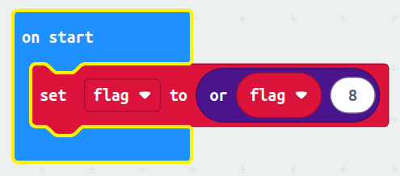
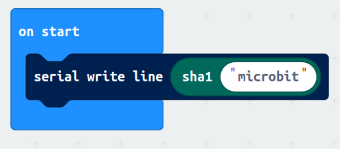
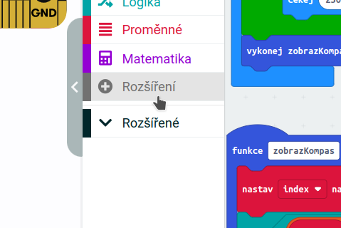
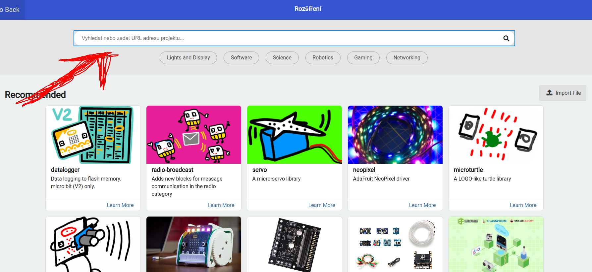
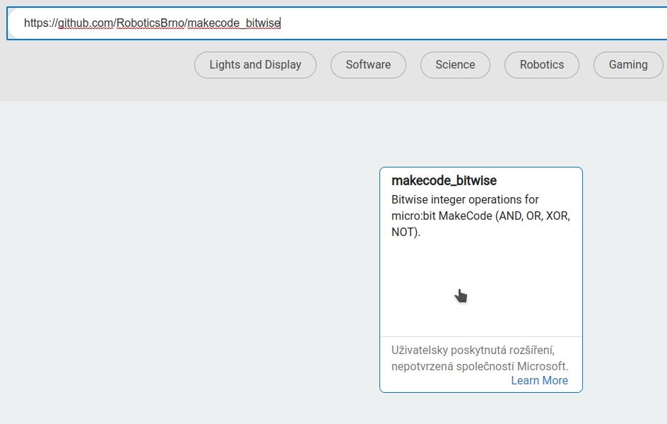

# Rozšíření

Funkce MakeCode lze rozšířit pomocí _rozšíření_.

## Naše rozšíření

### Bitwise operace
* **URL pro instalaci:** https://github.com/RoboticsBrno/makecode_bitwise

Implementace bitových operací pro bloky - AND, OR, XOR a NOT (&, |, ^, ~).

### Crypto operace
* **URL pro instalaci:** https://github.com/RoboticsBrno/makecode_crypto

Implementace crypto operací, např. SHA1 hash.

## Instalace rozšíření

 
1. Klikněte na tlačítko _Rozšíření_ (_Extensions_) v MakeCode.

 
2. Do horního řádku napište název toho, co hledáte, **nebo URL adresu jednoho z našich rozšíření**.

 
3. Klikněte na nalezené rozšíření. Přidá se vám jako další bloky do MakeCode editoru.

