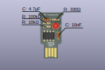
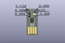
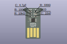
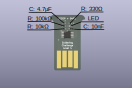
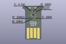

# Manuál

## Jak postupovat?

- **vždy pájej pouze jednu úroveň najednou!**
- jelikož malé součástky na sobě nemají popisky, choď si pro součástky po jedné.
  Vždy si dones jednu součástku, tu zapájej a až pak si běž pro další.
- začni připájením integrovaného obvodu - na něj potřebuješ nejvíce prostoru. U
  integrovaného obvodu si pohlídej jeho orientaci. Pokud si nejsi jistý, zeptej
  se lektora.
- pak můžeš zapájet ostatní součástky. U kondenzátorů a rezistorů nezáleží na
  orientaci. U LED diody ano - lektor ti ukáže, jak má být správně otočena.
- Jakmile máš zapájeno, nalep zespodu USB konektoru podložku (opět ti ji vydá
  lektor) a může obvod vyzkoušet!

## Co kam patří?

### Úroveň 1

!!! Pozor danger
    Pozor, u kondenzátoru 4.7u záleží na polaritě. Popisek kondenzátoru
    musí směřovat ven z desky. Zeptej se lektora, pokud si nejsi jistý.

### Úroveň 2

### Úroveň 3

### Úroveň 4

### Úroveň 5

## Jak to funguje?

Pokud tě zajímá, jak funguje obvod, který jsi právě zapájel, podívej se např. na
[tento web](https://www.mylms.cz/zapojeni-casovace-555/). Tam se dočteš, jak
funguje integrovaný obvod 555. V naší pájecí výzvě používáme takzvané *astabilní
zapojení* neboli *multivibrátor*, který je na výše zmíněné stránce vysvětlen.
